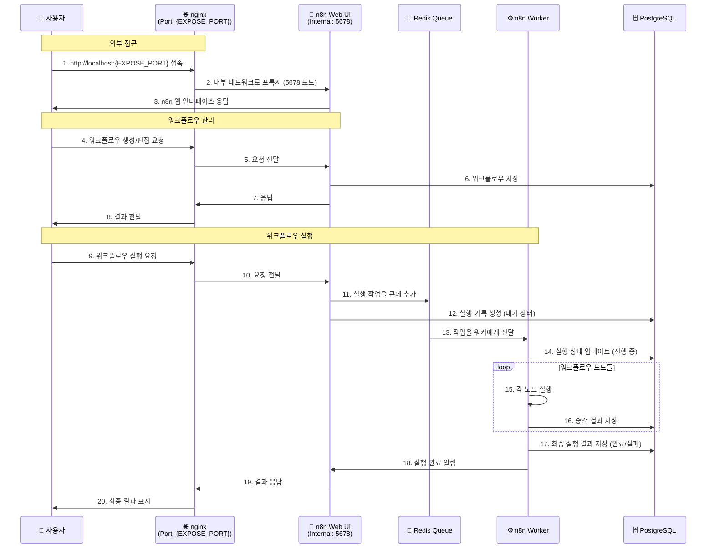
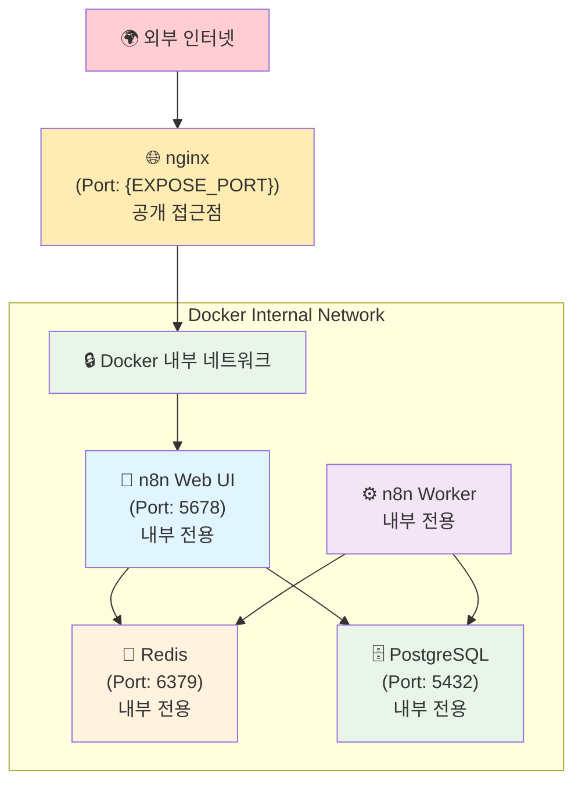
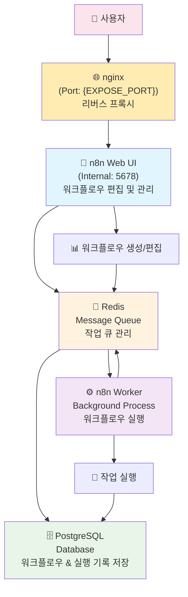
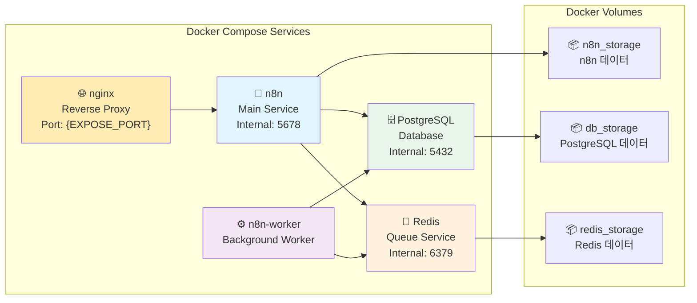
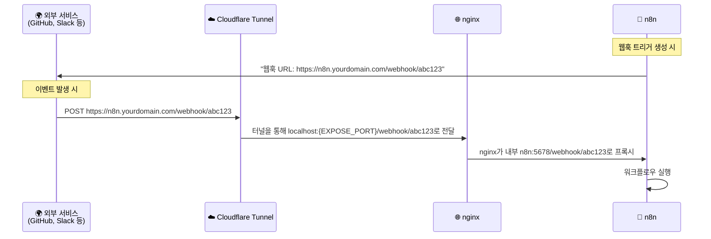

# n8n with PostgreSQL and Worker

PostgreSQL 데이터베이스와 워커를 분리된 컨테이너로 실행하는 n8n 자동화 워크플로우 플랫폼입니다.

## 🚀 프로젝트 개요

이 프로젝트는 다음과 같은 구성으로 이루어져 있습니다:

- **nginx**: 리버스 프록시 (외부 접근 관리)
- **n8n 메인 서비스**: 웹 인터페이스 및 API 서버
- **n8n 워커**: 백그라운드 작업 처리
- **PostgreSQL**: 데이터베이스 (워크플로우, 실행 기록 등 저장)
- **Redis**: 큐 시스템 (워커와 메인 서비스 간 작업 분배)

## 📋 사전 요구사항

- Docker 및 Docker Compose 설치
- 최소 4GB RAM 권장
- `.env` 파일에서 설정한 외부 포트가 사용 가능해야 함

## 🚀 빠른 시작

### 1단계: 환경 변수 설정

```bash
# env.example을 .env로 복사
cp env.example .env

# .env 파일을 편집하여 보안을 위해 기본 값들을 변경하세요
nano .env
```

**반드시 변경해야 할 항목들:**

- `POSTGRES_USER`, `POSTGRES_PASSWORD`: PostgreSQL 관리자 계정
- `POSTGRES_NON_ROOT_USER`, `POSTGRES_NON_ROOT_PASSWORD`: n8n 전용 DB 계정
- `ENCRYPTION_KEY`: n8n 데이터 암호화 키 (32자 이상)
- `EXPOSE_PORT`: 외부 접근 포트 번호
- `TUNNEL_NAME`: Cloudflare Tunnel 이름 (터널 사용 시)
- `WEBHOOK_URL`: 웹훅용 외부 접근 URL (터널 사용 시)

### 2단계: 서비스 시작

```bash
docker-compose up -d
```

서비스가 시작되면 브라우저에서 `http://localhost:{EXPOSE_PORT}`로 접속할 수 있습니다.

## 🔄 워크플로우 실행 흐름

### nginx를 통한 접근 흐름



### 네트워크 보안 흐름



## 🏗️ 아키텍처



## 🐳 Docker 서비스 구성



## 🔧 주요 명령어

### 서비스 관리

```bash
# 서비스 시작
docker-compose up -d

# 서비스 중지
docker-compose stop

# 서비스 상태 확인
docker-compose ps

# 로그 확인
docker-compose logs

# 완전 제거 (데이터 유지)
docker-compose down

# 완전 제거 (데이터도 삭제)
docker-compose down -v
```

### 백업 및 복원

```bash
# 데이터베이스 백업
./scripts/backup.sh

# 데이터베이스 복원
./scripts/restore.sh ./backups/백업파일명.sql

# Cloudflare Tunnel 실행
./scripts/tunnel.sh
```

## 📁 파일 구조

```text
.
├── docker-compose.yaml     # Docker 서비스 정의
├── env.example            # 환경 변수 템플릿
├── init-data.sh          # PostgreSQL 초기화 스크립트
├── nginx/
│   └── nginx.conf        # nginx 리버스 프록시 설정
└── scripts/
    ├── backup.sh         # DB 백업 스크립트
    ├── restore.sh        # DB 복원 스크립트
    ├── tunnel.sh         # Cloudflare Tunnel 실행
    └── common.sh         # 공통 함수 라이브러리
```

## 🛠️ 고급 설정

### 포트 변경

외부 포트를 변경하려면 `.env` 파일에서 `EXPOSE_PORT` 값을 수정하세요:

```bash
# .env 파일에서
EXPOSE_PORT=8080  # 원하는 포트로 변경
```

### Cloudflare Tunnel 설정

1. **터널 생성**

   ```bash
   cloudflared tunnel create n8n-tunnel
   cloudflared tunnel route dns n8n-tunnel n8n.yourdomain.com
   ```

2. **터널 설정 파일 (`config.yml`)**

   ```yaml
   tunnel: n8n-tunnel
   credentials-file: /path/to/credentials.json
   ingress:
   - hostname: n8n.yourdomain.com
     service: http://localhost:{EXPOSE_PORT}
   - service: http_status:404
   ```

3. **환경변수 설정**

   ```bash
   # .env 파일에서
   WEBHOOK_URL=https://n8n.yourdomain.com
   TUNNEL_NAME=n8n-tunnel
   ```

### 웹훅 작동 원리



## 🐛 문제 해결

### 일반적인 문제들

1. **포트 충돌**

   ```bash
   # 포트 사용 확인
   lsof -i :${EXPOSE_PORT}   # nginx (외부 접근)
   lsof -i :5678             # n8n (내부)
   lsof -i :5432             # PostgreSQL (내부)
   lsof -i :6379             # Redis (내부)
   ```

2. **서비스별 로그 확인**

   ```bash
   docker-compose logs nginx
   docker-compose logs n8n
   docker-compose logs n8n-worker
   docker-compose logs postgres
   docker-compose logs redis
   ```

3. **서비스 상태 확인**

   ```bash
   docker-compose ps
   docker stats
   ```

## 🔒 보안 고려사항

- `.env` 파일을 버전 관리에서 제외
- 강력한 비밀번호 사용
- `ENCRYPTION_KEY`는 32자 이상의 임의 문자열 사용
- 웹훅 URL에 예측하기 어려운 토큰 포함
- 프로덕션에서는 방화벽 설정
- 정기적인 백업 및 업데이트

## 📜 라이선스

이 프로젝트는 MIT 라이선스 하에 배포됩니다. 자세한 내용은 [LICENSE](LICENSE) 파일을 참조하세요.

**중요**: 이 프로젝트는 [n8n](https://github.com/n8n-io/n8n)을 사용하며, n8n은 [Sustainable Use License](https://github.com/n8n-io/n8n/blob/master/LICENSE.md) 하에 배포됩니다. 상업적 사용을 위해서는 n8n의 라이선스 조건을 확인하시기 바랍니다.

## 📚 추가 자료

- [n8n 공식 문서](https://docs.n8n.io/)
- [n8n 워크플로우 템플릿](https://n8n.io/workflows/)
- [n8n 커뮤니티](https://community.n8n.io/)
- [Docker Compose 문서](https://docs.docker.com/compose/)
- [Reference setup](https://github.com/n8n-io/n8n-hosting/tree/main/docker-compose/withPostgresAndWorker)
