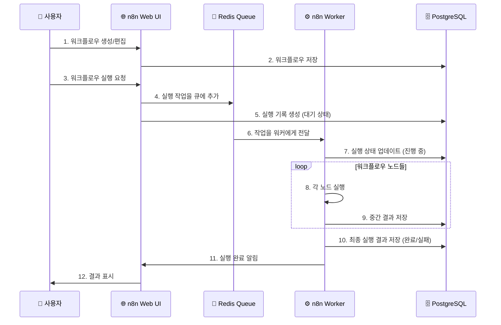
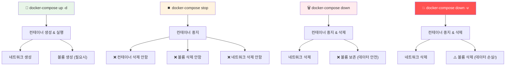
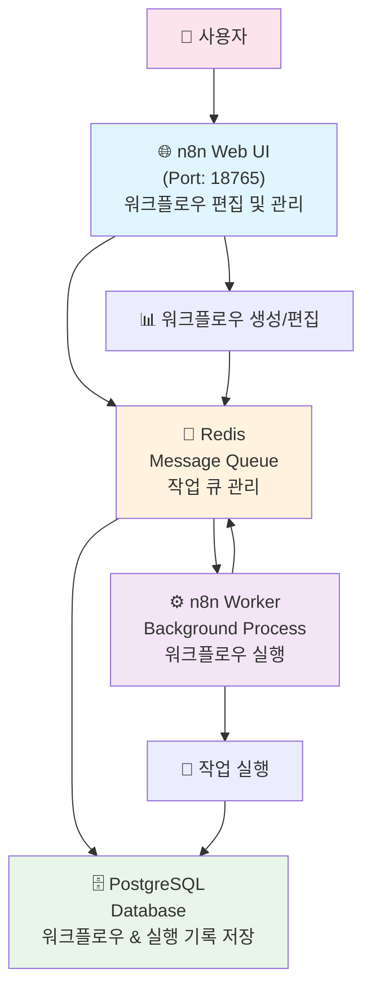
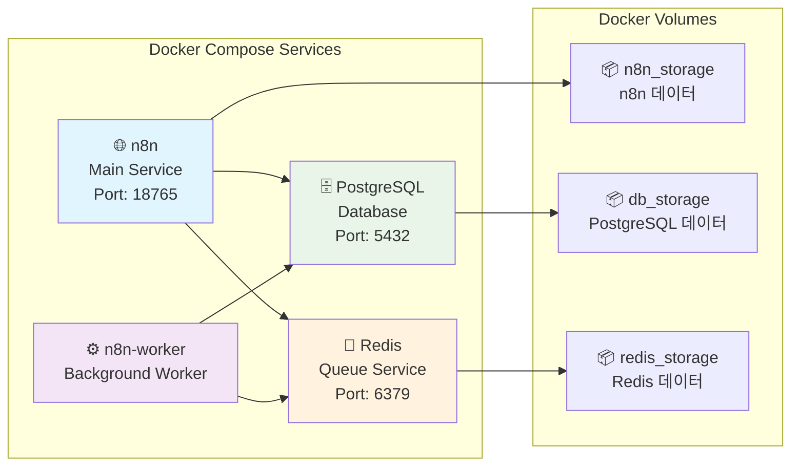
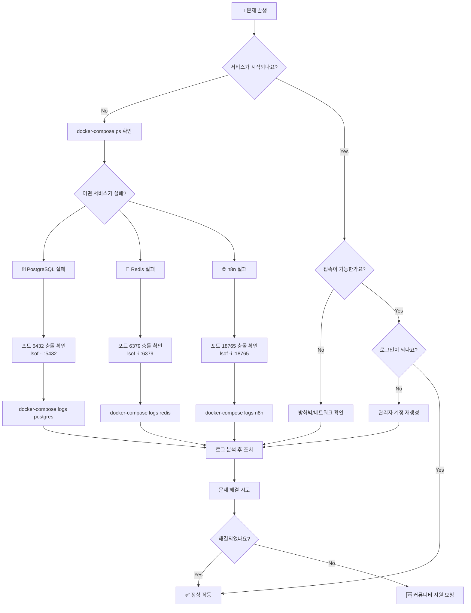

# n8n with PostgreSQL and Worker

PostgreSQL 데이터베이스와 워커를 분리된 컨테이너로 실행하는 n8n 자동화 워크플로우 플랫폼입니다.

## 🚀 프로젝트 개요

이 프로젝트는 다음과 같은 구성으로 이루어져 있습니다:

- **n8n 메인 서비스**: 웹 인터페이스 및 API 서버
- **n8n 워커**: 백그라운드 작업 처리
- **PostgreSQL**: 데이터베이스 (워크플로우, 실행 기록 등 저장)
- **Redis**: 큐 시스템 (워커와 메인 서비스 간 작업 분배)

## 📋 사전 요구사항

- Docker 및 Docker Compose 설치
- 최소 4GB RAM 권장
- 포트 18765가 사용 가능해야 함

## 🚀 빠른 시작

### 1단계: 자동 설정 실행

```bash
./scripts/setup.sh
```

### 2단계: 환경 변수 설정

**중요**: 시작하기 전에 반드시 환경 변수를 설정해야 합니다!

```bash
# env.example을 .env로 복사 (setup.sh가 자동으로 수행)
cp env.example .env

# .env 파일을 편집하여 보안을 위해 기본 값들을 변경하세요
nano .env
```

**반드시 변경해야 할 항목들:**

- `POSTGRES_USER`: PostgreSQL 관리자 사용자명
- `POSTGRES_PASSWORD`: PostgreSQL 관리자 비밀번호 (강력한 비밀번호로 변경)
- `POSTGRES_NON_ROOT_USER`: n8n에서 사용할 DB 사용자명
- `POSTGRES_NON_ROOT_PASSWORD`: n8n에서 사용할 DB 비밀번호 (다른 강력한 비밀번호로 변경)
- `ENCRYPTION_KEY`: n8n 데이터 암호화 키 (32자 이상의 임의 문자열로 변경)

### 3단계: 서비스 시작

n8n을 시작하려면 현재 폴더에서 다음 명령어를 실행하세요:

```bash
docker-compose up -d
```

서비스가 시작되면 브라우저에서 `http://localhost:18765`로 접속할 수 있습니다.

### 4단계: n8n 초기 설정

1. **첫 접속 시 관리자 계정 생성**
   - 이름, 이메일, 비밀번호 설정

2. **기본 설정 확인**
   - Settings > General 에서 기본 설정 확인
   - Executions > 실행 모드가 Queue로 설정되어 있는지 확인

3. **첫 워크플로우 만들기**
   - "Create your first workflow" 클릭
   - 간단한 테스트 워크플로우 생성

## 🔄 워크플로우 실행 흐름



## 🔧 주요 명령어

### 서비스 관리

```bash
# 서비스 시작
docker-compose up -d

# 서비스 중지
docker-compose stop

# 서비스 상태 확인
docker-compose ps

# 로그 확인
docker-compose logs

# 완전 제거 (데이터 유지)
docker-compose down

# 완전 제거 (데이터도 삭제)
docker-compose down -v
```

### Docker Compose 명령어 상세 설명

각 명령어가 컨테이너, 네트워크, 볼륨에 미치는 영향을 이해하는 것이 중요합니다.



#### 1. `docker-compose stop` - 안전한 중지

```bash
docker-compose stop
```

**동작:**

- ✅ 모든 컨테이너를 안전하게 중지
- ❌ 컨테이너, 네트워크, 볼륨 삭제하지 않음
- 🔄 `docker-compose start`로 빠르게 재시작 가능

**사용 시기:**

- 임시로 서비스를 중지할 때
- 시스템 리소스를 절약하고 싶을 때
- 빠른 재시작이 필요할 때

#### 2. `docker-compose down` - 정리하되 데이터 보존

```bash
docker-compose down
```

**동작:**

- ✅ 컨테이너 중지 및 삭제
- ✅ 네트워크 삭제
- ❌ **볼륨은 보존** (PostgreSQL, n8n, Redis 데이터 유지)

**사용 시기:**

- 컨테이너를 깨끗하게 재시작하고 싶을 때
- 설정 변경 후 완전히 재배포할 때
- 일반적인 개발/운영 중 재시작

**예시 출력:**

```bash
$ docker-compose down
Stopping gzu_n8n-n8n-worker-1 ... done
Stopping gzu_n8n-n8n-1        ... done
Stopping gzu_n8n-redis-1      ... done
Stopping gzu_n8n-postgres-1   ... done
Removing gzu_n8n-n8n-worker-1 ... done
Removing gzu_n8n-n8n-1        ... done
Removing gzu_n8n-redis-1      ... done
Removing gzu_n8n-postgres-1   ... done
Removing network gzu_n8n_default
```

#### 3. `docker-compose down -v` - 완전 초기화 (위험)

```bash
docker-compose down -v
```

**동작:**

- ✅ 컨테이너 중지 및 삭제
- ✅ 네트워크 삭제
- ⚠️ **모든 볼륨 삭제** (모든 데이터 완전 손실!)

**사용 시기:**

- 완전히 새로 시작하고 싶을 때
- 테스트 환경을 초기화할 때
- 데이터 손상으로 인해 처음부터 다시 설정할 때

**⚠️ 주의사항:**

```bash
# 이 명령어는 다음 데이터를 영구적으로 삭제합니다:
# - 모든 워크플로우
# - 실행 기록
# - 사용자 계정
# - 크리덴셜 정보
# - PostgreSQL, Redis, n8n 설정
```

### 🛡️ 데이터 보호 전략

#### 안전한 재시작 순서

```bash
# 1. 백업 생성 (선택사항)
./scripts/backup.sh

# 2. 서비스 중지 및 정리
docker-compose down

# 3. 새로 시작
docker-compose up -d
```

#### 완전 초기화가 필요한 경우

```bash
# 1. 반드시 백업 먼저!
./scripts/backup.sh

# 2. 모든 것 삭제
docker-compose down -v

# 3. 새로 시작
docker-compose up -d

# 4. 필요시 데이터 복원
./scripts/restore.sh ./backups/백업파일.sql
```

#### 볼륨 상태 확인

```bash
# 현재 볼륨 목록 확인
docker volume ls | grep gzu_n8n

# 볼륨 상세 정보 확인
docker volume inspect gzu_n8n_db_storage

# 볼륨 사용량 확인
docker system df -v
```

### 📊 명령어 비교표

| 명령어 | 컨테이너 | 네트워크 | 볼륨 | 데이터 | 재시작 속도 | 사용 목적 |
|--------|----------|----------|------|--------|------------|----------|
| `stop` | 중지 | 유지 | 유지 | ✅ 안전 | 🚀 빠름 | 임시 중지 |
| `down` | 삭제 | 삭제 | **유지** | ✅ 안전 | ⚡ 중간 | 일반 재시작 |
| `down -v` | 삭제 | 삭제 | **삭제** | ❌ 손실 | 🐌 느림 | 완전 초기화 |

### 백업 및 복원

```bash
# 데이터베이스 백업
./scripts/backup.sh

# 데이터베이스 복원
./scripts/restore.sh ./backups/백업파일명.sql
```

## 🏗️ 아키텍처



## 🐳 Docker 서비스 구성



## 📁 파일 구조

```text
.
├── docker-compose.yaml     # Docker 서비스 정의
├── env.example            # 환경 변수 템플릿
├── init-data.sh          # PostgreSQL 초기화 스크립트
├── .gitignore            # Git 제외 파일 목록
├── README.md             # 이 파일
└── scripts/
    ├── setup.sh          # 자동 설정 스크립트
    ├── backup.sh         # DB 백업 스크립트
    └── restore.sh        # DB 복원 스크립트
```

## 🛠️ 고급 설정

### 포트 변경

기본 포트(18765)를 변경하려면 `docker-compose.yaml`에서 다음 부분을 수정하세요:

```yaml
n8n:
  ports:
    - "8080:5678"  # 8080 포트로 변경 (호스트:컨테이너)
```

### 메모리 제한 설정

`docker-compose.yaml`에 메모리 제한 추가:

```yaml
n8n:
  deploy:
    resources:
      limits:
        memory: 1G
```

### SSL/TLS 설정

프로덕션 환경에서는 reverse proxy (nginx, traefik 등)를 사용하여 SSL을 설정하세요.

## 🐛 문제 해결

### 문제 해결 플로우



### 일반적인 문제들

1. **포트 충돌**

   ```bash
   # 포트 사용 확인
   lsof -i :18765  # n8n Web UI
   lsof -i :5432  # PostgreSQL
   lsof -i :6379  # Redis
   ```

2. **메모리 부족**
   - Docker Desktop의 메모리 할당량 증가
   - 불필요한 컨테이너 정리

3. **권한 문제**

   ```bash
   # Docker 그룹에 사용자 추가 (Linux/Mac)
   sudo usermod -aG docker $USER
   ```

4. **데이터베이스 연결 실패**

   ```bash
   # PostgreSQL 컨테이너 로그 확인
   docker-compose logs postgres
   ```

### 서비스별 로그 확인

```bash
# n8n 메인 서비스
docker-compose logs n8n

# n8n 워커
docker-compose logs n8n-worker

# PostgreSQL
docker-compose logs postgres

# Redis
docker-compose logs redis
```

### 서비스 상태 확인

```bash
# 서비스 상태 확인
docker-compose ps

# 컨테이너별 리소스 사용량
docker stats
```

## 🔒 보안 고려사항

1. **환경 변수 보안**
   - `.env` 파일을 버전 관리에서 제외
   - 강력한 비밀번호 사용

2. **네트워크 보안**
   - 프로덕션에서는 방화벽 설정
   - 필요시 VPN 접속만 허용

3. **정기 백업**
   - 매일 자동 백업 스케줄 설정
   - 백업 파일의 안전한 보관

4. **업데이트**
   - 정기적인 n8n 버전 업데이트
   - 보안 패치 적용

## 📚 추가 자료

- [n8n 공식 문서](https://docs.n8n.io/)
- [n8n 워크플로우 템플릿](https://n8n.io/workflows/)
- [n8n 커뮤니티](https://community.n8n.io/)
- [Docker Compose 문서](https://docs.docker.com/compose/)
- [Reference setup](https://github.com/n8n-io/n8n-hosting/tree/main/docker-compose/withPostgresAndWorker)
